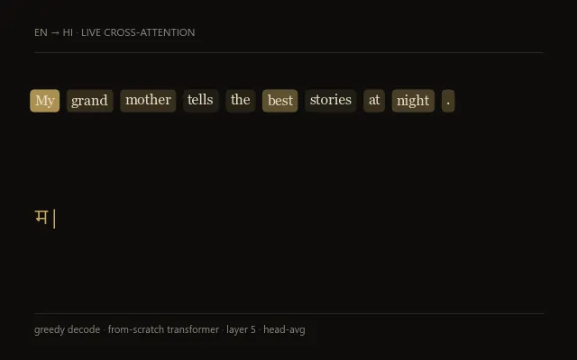
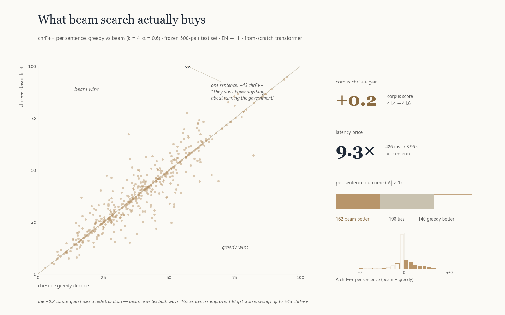
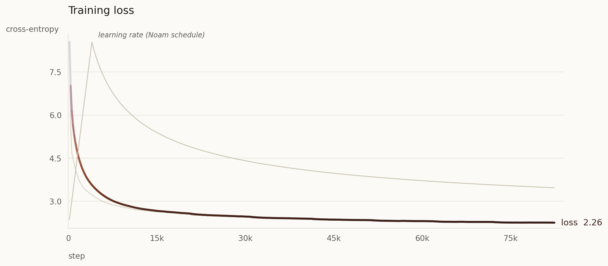
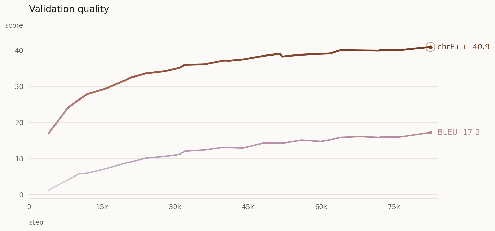
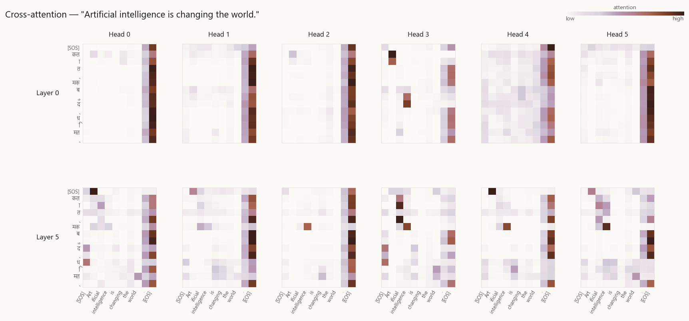

<div align="center">

# EN → HI // TRANSLATION TRANSFORMER

**A 6-layer Transformer built from scratch in PyTorch — no `nn.Transformer`, no `transformers` — trained English→Hindi on AI4Bharat Samanantar.**


</div>

---

A 6-layer Transformer (Vaswani et al., 2017) implemented **from scratch in PyTorch** and trained on AI4Bharat's [Samanantar](https://huggingface.co/datasets/ai4bharat/samanantar) parallel corpus. Ships with a length-normalized beam-search decoder, a frozen held-out test set, an honest evaluation pipeline, and a Gradio app with live attention visualization.

```
EN  ▶  Good morning, how are you today?          HI  ▶  अच्छा, आज आप कैसे हैं?
EN  ▶  She is reading a book in the library.     HI  ▶  वह लाइब्रेरी में एक पुस्तक पढ़ रही है।
```

```bash
python translate.py "Type any English sentence here."
python app.py   # Gradio UI with attention heatmap, http://127.0.0.1:7860
```

<p align="center">
  
  <br>
  <em>Greedy decode, live — each Hindi token lights up the English words the decoder is attending to (cross-attention, layer 5, head-average).</em>
</p>

## Results

Evaluated on 500 pairs from the frozen 5,000-pair held-out test set (never touched during training):

| Decoder | SacreBLEU ↑ | chrF++ ↑ | TER ↓ | Mean latency | Throughput |
| --- | ---: | ---: | ---: | ---: | ---: |
| Greedy | 16.18 | 41.36 | 74.38 | 426 ms / sent | 134 tok/s |
| Beam (k = 4, α = 0.6) | **16.93** | **41.58** | **71.41** | 3.96 s / sent | 14 tok/s |

Full report in [`results/eval_report.json`](results/eval_report.json); every prediction in [`results/predictions.tsv`](results/predictions.tsv).

> **BLEU vs. chrF++.** Samanantar's references are paraphrastic web-mined translations, not literal renditions, so BLEU penalizes valid synonym choices that chrF++ credits. chrF++ ≈ 41 with hand-checked sample quality is the meaningful signal.

### What beam search actually buys

Per-sentence analysis over all 500 test pairs: beam's +0.2 corpus chrF++ is a **two-way rewrite**, not a uniform upgrade — 162 sentences improve, 140 get worse (swings up to ±43 chrF++), with no reliable length effect — at 9.3× the latency. Greedy ships with the demo; beam is for offline batches.

<p align="center">
  <picture>
    <source media="(prefers-color-scheme: dark)" srcset="beam_analysis_dark.png">
    
  </picture>
</p>

### Training curves

8 epochs on 500k filtered Samanantar pairs (~83k steps). Validation chrF++ climbed monotonically 17 → 41; cross-entropy converged just above 2.0.

<p align="center">
  <picture>
    <source media="(prefers-color-scheme: dark)" srcset="beautiful_train_loss_dark.png">
    
  </picture>
  <br>
  <picture>
    <source media="(prefers-color-scheme: dark)" srcset="beautiful_metrics_dark.png">
    
  </picture>
  <br>
  <em>Loss along the run (Noam warmup then 1/√step decay), and validation SacreBLEU / chrF++ every 4,000 steps.</em>
</p>

## Qualitative samples

Auto-selected from `results/predictions.tsv` by `pick_samples.py` (top-chrF and length-bucket winners — no manual cherry-picking):

| Source (English) | Beam (k = 4) | chrF++ |
| --- | --- | ---: |
| They don't know anything about running the government. | उन्हें सरकार चलाने के बारे में कुछ भी पता नहीं है। | 100.0 |
| It was a very tough show. | यह बहुत मुश्किल शो था। | 93.5 |
| Mishra refused to comment on the media queries over Dr Gupta's allegations. | मिश्रा ने डॉ. गुप्ता के आरोपों पर मीडिया के सवालों पर टिप्पणी करने से इनकार कर दिया। | 95.0 |

More in [`results/qualitative_samples.md`](results/qualitative_samples.md).

### Where the model looks

Decoder **cross-attention** shows, for every Hindi token, which English tokens the model aligned to — e.g. Head 3 of layer 5 aligns "Art*" with "आर्ट", Head 2 lines up "intelligence" with "इंटेलिजेंस".

<p align="center">
  <picture>
    <source media="(prefers-color-scheme: dark)" srcset="results/visualizations/encoder-decoder_dark.png">
    
  </picture>
  <br>
  <em>Cross-attention from each Hindi token (rows) to each English token (columns), layers 0 and 5, all 6 heads.</em>
</p>

Decoder self-attention is strictly lower-triangular (causal mask): early layers learn "look at the previous token", later layers spread out. A full walk-through of all three attention families is in [`attention_visual.ipynb`](attention_visual.ipynb).

## Architecture

| Layers (enc / dec) | `d_model` | Heads | `d_ff` | Params | Tokenizer | Max len | Precision |
| :---: | :---: | :---: | :---: | :---: | :---: | :---: | :---: |
| 6 / 6 | 384 | 6 | 1,536 | ~43M | byte-level BPE, 16k/lang | 128 | fp16 (mixed) |

Every block in `model.py` is a small `nn.Module` named after the paper, so the file reads like *Attention Is All You Need*.

## Quickstart

```bash
python -m venv .venv && .venv\Scripts\activate         # Windows (source .venv/bin/activate on Unix)
pip install --index-url https://download.pytorch.org/whl/cu128 torch    # CPU wheel works but ~30× slower
pip install -r requirements.txt

python translate.py "Good morning, how are you today?"   # CLI translate
python app.py                                            # Gradio demo (beam/α sliders + attention)
```

Reproduce end-to-end:

```bash
python run_all.py     # idempotent: train → eval → plots (skips training if a checkpoint exists)
```

Scope is set in `config.py` — `max_train_examples` (`None` = full 10M Samanantar, default `500_000`), plus `num_epochs`, `d_model`, etc.

## Repository layout

```
model.py              Transformer blocks (the paper, in PyTorch)
dataset.py            bilingual dataset + causal mask
tokenizer_train.py    byte-level BPE training / loading
train.py              training loop: Noam schedule + best-chrF++ checkpointing
decode.py             greedy and length-normalized beam search
eval.py               held-out test eval (BLEU / chrF++ / TER / latency)
translate.py · app.py CLI translator · Gradio demo (translation + attention)
plot_metrics.py · make_attention_pngs.py   figure rendering (light + dark)
run_all.py · config.py   one-command pipeline · hyperparameter source of truth
```

## What changed across the rebuild

The original 2024 version trained on the [IITB En-Hi corpus](https://huggingface.co/datasets/cfilt/iitb-english-hindi) with a word-level tokenizer and reported a misleadingly high BLEU on a tiny 5-sentence in-loop slice — a mirage: word-level BPE without a ByteLevel decoder dropped spaces at decode time (zero n-gram overlap on a real test set), and IITB is bimodal (UI strings + religious text) so the model couldn't translate everyday English. The rebuild swaps in Samanantar and retrains with a paper-faithful recipe.

| | Old (2024) | New |
| --- | --- | --- |
| Dataset | IITB (UI + religious) | **Samanantar** (curated web crawl) |
| Tokenizer | word-level | **byte-level BPE**, 16k/lang |
| LR schedule | Adam 1e-4 + plateau | **Noam** warmup + 1/√step |
| Decoding | greedy | **greedy + length-normalized beam** |
| Evaluation | 5 in-loop samples | **frozen 5k test set: BLEU + chrF++ + TER** |
| Checkpoint | last epoch | **highest validation chrF++** |
| "Good morning, how are you?" | nonsense | **"अच्छा, आज आप कैसे हैं?"** |

## Honest caveats

- **The metrics are a lower bound** — `sacrebleu` as-is, no Indic morphological normalization; paraphrastic references cost BLEU points.
- **Training was deliberately bounded** — 500k of 10M pairs, 8 epochs on one 12 GB GPU (~3 h). Uncap `max_train_examples` and the recipe scales cleanly.
- **Production systems are far ahead** — [IndicTrans2](https://github.com/AI4Bharat/IndicTrans2) trains on the full 10M with larger models. The point here is the from-scratch architecture and end-to-end pipeline, not a benchmark number.

## References

[Attention Is All You Need](https://arxiv.org/abs/1706.03762) (Vaswani et al., 2017) · [GNMT length penalty](https://arxiv.org/abs/1609.08144) (Wu et al., 2016) · [byte-level BPE / GPT-2](https://cdn.openai.com/better-language-models/language_models_are_unsupervised_multitask_learners.pdf) · [Samanantar](https://indicnlp.ai4bharat.org/samanantar/) (AI4Bharat)

MIT — see [`LICENSE`](LICENSE).
