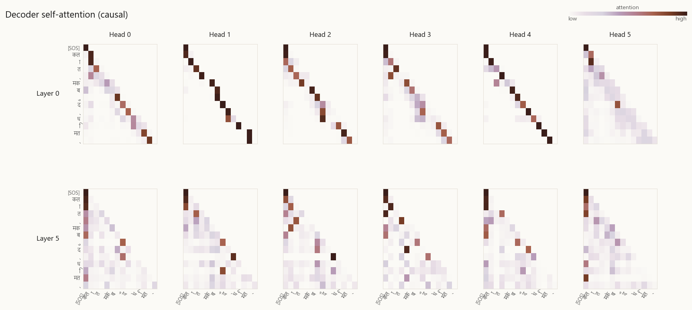

# English → Hindi Neural Machine Translation

A 6-layer Transformer (Vaswani et al., 2017) built **from scratch in PyTorch** —
no `nn.Transformer`, no `transformers` library — and trained on AI4Bharat's
[Samanantar](https://huggingface.co/datasets/ai4bharat/samanantar) parallel
corpus. Ships with a beam-search decoder, a held-out test set, an honest
evaluation pipeline, and a Gradio app for interactive translation with
attention visualization.

---

## Try it on a few sentences

```
EN  ▶  Good morning, how are you today?
HI  ▶  अच्छा, आज आप कैसे हैं?

EN  ▶  Artificial intelligence is changing the world.
HI  ▶  आर्टिफिशियल इंटेलिजेंस दुनिया में बदल रही है।

EN  ▶  She is reading a book in the library.
HI  ▶  वह लाइब्रेरी में एक पुस्तक पढ़ रही है।
```

Generate your own:

```bash
python translate.py "Type any English sentence here."
python app.py   # Gradio UI with attention heatmap, http://127.0.0.1:7860
```

---

## Headline numbers

Evaluated on 500 pairs from the frozen 5 000-pair held-out test set
(never touched during training):

| Decoder | SacreBLEU ↑ | chrF++ ↑ | TER ↓ | Mean latency | Throughput |
| --- | ---: | ---: | ---: | ---: | ---: |
| Greedy | 16.18 | 41.36 | 74.38 | 426 ms / sent | 134 tok/s |
| Beam (k = 4, α = 0.6) | **16.93** | **41.58** | **71.41** | 3.96 s / sent | 14 tok/s |

> Full report at [`results/eval_report.json`](results/eval_report.json);
> every test prediction is in [`results/predictions.tsv`](results/predictions.tsv).

**Why two decoders?** Greedy is the fast path that ships with the demo;
beam search trades latency for TER improvements and noticeably more fluent
output on longer sentences.

**A note on BLEU vs. chrF++.** Samanantar's references are paraphrastic
web-mined translations rather than literal word-by-word renditions, so BLEU
penalizes the model for valid synonym choices that chrF++ correctly credits.
chrF++ ≈ 41 with hand-checked sample quality (see below) is the meaningful
signal here.

### Training curves

The model trained for 8 epochs on 500 k filtered Samanantar pairs (~83 k
steps). Validation chrF++ climbed monotonically from 17 → 41; cross-entropy
loss converged just above 2.0.

<p align="center">
  <picture>
    <source media="(prefers-color-scheme: dark)" srcset="beautiful_train_loss_dark.png">
    
  </picture>
  <br>
  <em>Cross-entropy loss along the training run — gradient coloured so the line warms as the loss converges. The faint trace is the Noam learning-rate schedule (warmup, then 1/√step decay).</em>
</p>
<p align="center">
  <picture>
    <source media="(prefers-color-scheme: dark)" srcset="beautiful_metrics_dark.png">
    
  </picture>
  <br>
  <em>Validation SacreBLEU and chrF++ every 4 000 steps. Lines are coloured by their absolute score, so higher-quality regions glow warmer.</em>
</p>

---

## Qualitative samples

Picked from `results/predictions.tsv` by `pick_samples.py` (top-chrF and
length-bucket winners — no manual cherry-picking).

| Source (English) | Reference (Hindi) | Beam (k = 4) | chrF++ |
| --- | --- | --- | ---: |
| They don't know anything about running the government. | उन्हें सरकार चलाने के बारे में कुछ भी पता नहीं है। | उन्हें सरकार चलाने के बारे में कुछ भी पता नहीं है। | 100.0 |
| It was a very tough show. | यह बहुत मुश्किल शो था. | यह बहुत मुश्किल शो था। | 93.5 |
| Mishra refused to comment on the media queries over Dr Gupta's allegations. | मिश्रा ने गुप्ता के आरोपों पर मीडिया के सवालों पर टिप्पणी करने से इनकार कर दिया। | मिश्रा ने डॉ. गुप्ता के आरोपों पर मीडिया के सवालों पर टिप्पणी करने से इनकार कर दिया। | 95.0 |
| In the second leg of his visit to Jammu and Kashmir, Prime Minister, Shri Narendra Modi visited Jammu today | प्रधानमंत्री श्री नरेंद्र मोदी ने आज जम्मू-कश्मीर की अपनी यात्रा के दूसरे चरण में, जम्मू का दौरा किया | जम्मू-कश्मीर की अपनी यात्रा के दूसरे चरण में प्रधानमंत्री श्री नरेन्द्र मोदी ने आज जम्मू का दौरा किया | 91.3 |

A larger set is at [`results/qualitative_samples.md`](results/qualitative_samples.md).

### Where the model looks while translating

The decoder's **cross-attention** maps show, for every Hindi token produced,
which English tokens the model paid attention to. In the example below, Head 3
of layer 5 has clearly learned to align the English word "Art*" with the
transliterated Hindi token "आर्ट"; Head 2 lines up "intelligence" with
"इंटेलिजेंस". Multiple heads also funnel attention into `[EOS]` — a typical
sink pattern.

<p align="center">
  <picture>
    <source media="(prefers-color-scheme: dark)" srcset="results/visualizations/encoder-decoder_dark.png">
    
  </picture>
  <br>
  <em>Cross-attention from each Hindi token (rows) to each English token (columns) — layers 0 and 5, all 6 heads.</em>
</p>

Decoder self-attention is strictly lower-triangular thanks to the causal mask.
Early-layer heads learn near-perfect "look at the previous token" patterns;
later layers spread out as more global context becomes useful.

<p align="center">
  <picture>
    <source media="(prefers-color-scheme: dark)" srcset="results/visualizations/decoder_dark.png">
    
  </picture>
  <br>
  <em>Decoder self-attention. Top: clean diagonals (layer 0) confirm the causal mask works. Bottom: dispersed, context-sensitive patterns (layer 5).</em>
</p>

A short notebook walk-through of all three attention families
(encoder self / decoder self / cross) is in
[`attention_visual.ipynb`](attention_visual.ipynb).

---

## Architecture

```
Source (English)                                  Target (Hindi)
       │                                                │
       ▼                                                ▼
 [BPE tokens, ByteLevel]                          [BPE tokens, ByteLevel]
       │                                                │
   ┌───┴────────┐                              ┌────────┴───┐
   │ Embedding  │                              │ Embedding  │
   │ + sin/cos  │                              │ + sin/cos  │
   │ positions  │                              │ positions  │
   └───┬────────┘                              └────────┬───┘
       │                                                │
   ┌───▼──────────────┐ × 6              ┌──────────────▼───┐ × 6
   │ Multi-head       │                  │ Masked multi-head │
   │ self-attention   │                  │ self-attention    │
   │   + FFN          │                  │     ↓             │
   │ (Encoder block)  │ ───── K, V ────▶ │ Cross-attention   │
   └──────────────────┘                  │     ↓             │
                                         │ FFN               │
                                         │ (Decoder block)   │
                                         └────────┬──────────┘
                                                  │
                                          ┌───────▼───────┐
                                          │ Projection    │
                                          │  → vocab      │
                                          └───────┬───────┘
                                                  │
                                          Hindi tokens ▼
```

| | |
| --- | --- |
| Layers (encoder / decoder) | 6 / 6 |
| `d_model` | 384 |
| Heads | 6 |
| `d_ff` (FFN inner) | 1 536 |
| Trainable parameters | ~43 M |
| Tokenizer | byte-level BPE, 16 k vocab per language |
| Max sequence length | 128 subword tokens |
| Precision | fp16 (mixed) on the GPU |

Every block in `model.py` is a small, self-contained `nn.Module` that mirrors
the names in _Attention Is All You Need_, so the file reads like the paper.

---

## Quickstart

```bash
git clone https://github.com/KaranAnchan/en-hi-nmt-transformer.git
cd en-hi-nmt-transformer

python -m venv .venv
.venv\Scripts\activate            # Windows
# source .venv/bin/activate       # Linux / macOS

# PyTorch with CUDA 12.8 — works on Ada / Hopper / Blackwell GPUs.
# Use the CPU wheel only if you don't have a CUDA GPU; training will be ~30× slower.
pip install --index-url https://download.pytorch.org/whl/cu128 torch torchvision torchaudio
pip install -r requirements.txt
```

### Translate a sentence

```bash
python translate.py "Good morning, how are you today?"
```

### Launch the Gradio demo

```bash
python app.py
# open http://127.0.0.1:7860
```

The demo has sliders for beam size and length penalty α, and renders the
cross-attention heatmap for every translation.

### Reproduce training

```bash
python train.py                          # ~3 h for 8 epochs on an RTX 5070 (500 k subset)
python eval.py                           # writes results/eval_report.json + predictions.tsv
python plot_metrics.py --both            # training-curve PNGs, light + dark themes
python make_attention_pngs.py --both     # attention heatmap PNGs, light + dark themes
```

Or in one shot:

```bash
python run_all.py          # idempotent: skips training if weights/tmodel_best.pt exists
```

Adjust scope in `config.py`:
- `max_train_examples` — `None` for the full 10 M-pair Samanantar corpus,
  or an int for fast iteration (default: `500_000`).
- `num_epochs`, `batch_size`, `d_model`, etc.

---

## Repository layout

```
.
├── model.py              Transformer building blocks (the paper, in PyTorch)
├── dataset.py            Bilingual dataset + causal mask
├── tokenizer_train.py    Byte-level BPE training / loading
├── train.py              Training loop with Noam schedule + best-chrF++ checkpointing
├── decode.py             Greedy and length-normalized beam search
├── eval.py               Held-out test eval (BLEU / chrF++ / TER / latency)
├── pick_samples.py       Auto-pick interesting strong/weak samples from predictions.tsv
├── translate.py          CLI translator
├── app.py                Gradio demo (translation + attention heatmap)
├── plot_metrics.py       Render training-curve PNGs from CSV logs (--dark / --both)
├── make_attention_pngs.py  Render attention heatmaps from a checkpoint (--dark / --both)
├── attention_heatmap.py  Reusable matplotlib helpers
├── theme.py              Shared minimalist-luxury palette (light + dark)
├── attention_visual.ipynb  Interpretability walk-through
├── inference.ipynb       Notebook for ad-hoc translation
├── run_all.py            train → eval → plots in one command
├── config.py             Single source of truth for hyperparameters
└── requirements.txt
```

---

## What changed across the rebuild

The original 2024 version of this project trained on the
[IIT-Bombay En-Hi corpus](https://huggingface.co/datasets/cfilt/iitb-english-hindi)
with a word-level tokenizer and reported BLEU ≈ 62 on a 5-sentence in-loop
validation slice. Two things made those numbers a mirage:

1. **Word-level BPE without a ByteLevel decoder dropped spaces** at decode
   time — translations rendered as one giant unspaced string, so BLEU saw
   zero n-gram overlap on the proper test set. ByteLevel BPE fixes this in
   one config change (spaces become part of the token alphabet as `Ġ`).
2. **The IITB corpus is bimodal**: software UI strings (`LDAP Query`,
   `Discard the current modified project`) on one end and long religious
   text on the other, with very little natural English in between. A model
   trained on IITB can score high BLEU on IITB but can't translate
   "Good morning, how are you today?" → it never saw anything like that.

The rebuild swaps in **Samanantar** (10 M curated en-hi pairs, the dataset
IndicTrans2 uses) and retrains with a paper-faithful Noam schedule, label
smoothing, byte-level BPE, beam search, and a frozen test split.

| | Old | New |
| --- | --- | --- |
| Dataset | IITB (UI + religious text) | **Samanantar** (curated web crawl) |
| Tokenizer | Word-level | **Byte-level BPE**, 16 k/lang |
| Training filter | `len(text.split()) <= 10` | Length-ratio filter, full distribution |
| LR schedule | Adam @ 1e-4 + `ReduceLROnPlateau` | Noam warmup + 1/√step (paper) |
| Decoding | Greedy only | **Greedy + length-normalized beam** |
| Evaluation | 5 in-loop samples | **Frozen 5 k-pair test set, SacreBLEU + chrF++ + TER** |
| Best checkpoint | Last epoch | **Highest validation chrF++** during training |
| Demo | None | **Gradio app + CLI + attention heatmap** |
| "Good morning, how are you?" | Nonsense | **"अच्छा, आज आप कैसे हैं?"** |

---

## Honest caveats

- **The metric numbers are a lower bound.** `sacrebleu` is used as-is, no
  Indic-NLP morphological normalization. Samanantar references are
  paraphrastic, so meaning-preserving substitutions cost BLEU points.
- **Training was deliberately bounded.** 500 k of 10 M pairs and 8 epochs on
  a single 12 GB GPU (~3 hours). Uncap `max_train_examples` and bump
  `num_epochs` to push the numbers higher; the recipe scales cleanly.
- **Production systems are still far ahead.** [IndicTrans2](https://github.com/AI4Bharat/IndicTrans2)
  is trained on the full 10 M with much larger models and additional
  fine-tuning data. The point of this repo is the architecture and the
  end-to-end pipeline, not a benchmark number.

---

## Acknowledgements

- Dataset: [Samanantar](https://indicnlp.ai4bharat.org/samanantar/) (AI4Bharat).
- Architecture: _[Attention Is All You Need](https://arxiv.org/abs/1706.03762)_, Vaswani et al., 2017.
- Length-penalty formula: _[Google's Neural Machine Translation System](https://arxiv.org/abs/1609.08144)_, Wu et al., 2016.
- Byte-level BPE: _[Language Models are Unsupervised Multitask Learners](https://cdn.openai.com/better-language-models/language_models_are_unsupervised_multitask_learners.pdf)_, Radford et al., 2019 (GPT-2).
